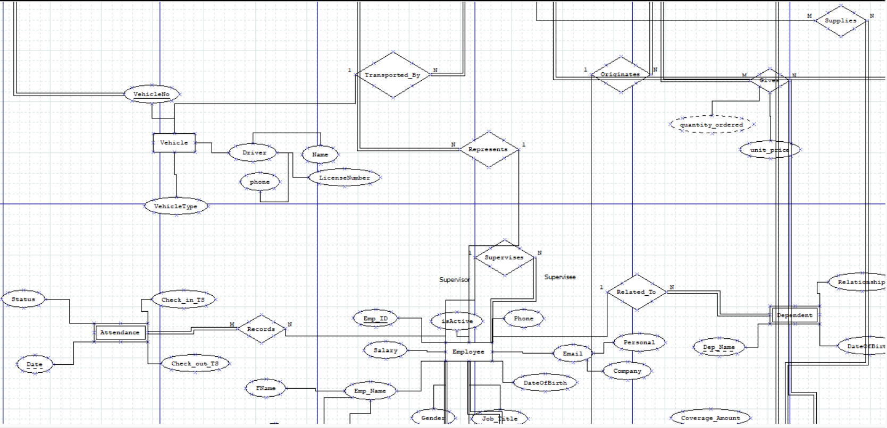

# Textile Manufacturing Operations Management System (DBMS)

> A production-grade, enterprise PostgreSQL database system designed to manage end-to-end operations for a multi-facility textile garment manufacturing business — covering raw material procurement, supplier management, multi-department workforce allocation, production order phase execution, inventory control, quality inspection, and bulk order fulfillment.

---

## 🌟 Key Features & Business Use Cases

The system covers 7 core operational business domains:

1. **Procurement & Supplier Management**: Tracks raw material purchases, unit price negotiations, supplier contact details, multi-location vendors, and transport logistics.
2. **Departmental Workforce & HR Allocation**: Manages employees, department managers, supervisors, shift schedules, attendance, dependents, extra bank/insurance details, and worker wage aggregations.
3. **Production Order Phase Execution**: Tracks multi-phase production workflows (Spinning, Weaving, Dyeing & Finishing, Packing), step sequence execution, timestamps, phase resource consumption, and wastage.
4. **Quality Control (QC) & Packing**: Tracks inspection results, batch packaging, fabric roll grading, storage rack placement, and pass/fail batch statuses.
5. **Multi-Warehouse Stock Management**: Monitors warehouse capacities, zone allocations, raw material stock levels, reorder thresholds, and consignment deliveries.
6. **Bulk Customer Orders & Financial History**: Integrates purchase order aggregations with invoice tracking, tax amounts, discounts, due dates, and payment statuses (`pending`, `partial`, `paid`).
7. **Logistics & Consignment Tracking**: Manages transport vehicles, drivers, license information, consignment delivery timestamps, and expected arrival schedules.

---

## 🛠️ Technology Stack

- **Database Engine**: PostgreSQL (12+)
- **SQL Standards**: ANSI SQL compliant with PostgreSQL dialect extensions (window functions, CTEs, interval arithmetic, JSON/type casting).
- **Design Methodology**: Entity-Relationship Modeling, Relational Synthesis, Formal Normalization up to **Boyce-Codd Normal Form (BCNF)**.

---

## 📊 Entity & Schema Highlights

- **ER Entities**: 21 Logical Entities (including 6 Weak Entities).
- **Physical Schema Tables**: 34 Normalized Tables (including 13 junction and ternary aggregation tables).
- **Integrity Constraints**: Comprehensive `PRIMARY KEY`, `FOREIGN KEY (ON DELETE CASCADE)`, `UNIQUE`, `CHECK`, and `NOT NULL` constraints.

---

## 🗺️ Entity-Relationship (ER) Diagram

The system architecture is modeled with **21 Logical ER Entities** and **34 Physical Relations** (including weak entities, junction tables, and 3-way ternary wage/resource aggregations).

<p align="center">
  
</p>

*Source files available in PlantUML ([`docs/er_diagram.puml`](docs/er_diagram.puml)) and Mermaid ([`docs/er_diagram.mmd`](docs/er_diagram.mmd)).*

---

## 📐 Formal Normalization Summary (BCNF Proof)

All 34 relations in the schema have been derived from scratch and verified to achieve **Boyce-Codd Normal Form (BCNF)**.

### Formal Normalization Criteria
- **BCNF**: For every non-trivial Functional Dependency $X \rightarrow Y$, $X$ is a candidate key (superkey).
- **4NF**: For every non-trivial Multi-Valued Dependency $X \twoheadrightarrow Y$, $X$ is a superkey.
- **BCNF**: Every non-trivial Join Dependency $\bowtie(R_1, R_2, \dots, R_n)$ is implied by the candidate keys of $R$.

### Summary Table of Verified Schema Relations

| Relation Name | Primary Key | Candidate Keys | Highest Normal Form |
| :--- | :--- | :--- | :--- |
| `Department` | `Dept_ID` | `{Dept_ID}`, `{Dept_Name}` | **BCNF** |
| `Employee` | `Emp_ID` | `{Emp_ID}`, `{Company_Email}` | **BCNF** |
| `Company` | `Company_ID` | `{Company_ID}`, `{Company_Email}`, `{GSTIN}` | **BCNF** |
| `Company_Type` | `(Company_ID, Company_Type)` | `{(Company_ID, Company_Type)}` | **BCNF** |
| `Company_Location` | `(Company_ID, PIN)` | `{(Company_ID, PIN)}` | **BCNF** |
| `Shift` | `Shift_ID` | `{Shift_ID}` | **BCNF** |
| `OrderInvoice` | `Invoice_ID` | `{Invoice_ID}` | **BCNF** |
| `RawMaterial` | `Material_ID` | `{Material_ID}` | **BCNF** |
| `Warehouse` | `Warehouse_ID` | `{Warehouse_ID}` | **BCNF** |
| `Vehicle` | `VehicleNo` | `{VehicleNo}`, `{License_Number}` | **BCNF** |
| `PurchaseOrder` | `Order_ID` | `{Order_ID}` | **BCNF** |
| `Consignment` | `Consignment_ID` | `{Consignment_ID}` | **BCNF** |
| `ExtraEmployeeDetails` | `Emp_ID` | `{Emp_ID}` | **BCNF** |
| `Dependent` | `(Emp_ID, Dep_Name)` | `{(Emp_ID, Dep_Name)}` | **BCNF** |
| `Attendance` | `(Emp_ID, Att_Date)` | `{(Emp_ID, Att_Date)}` | **BCNF** |
| `Employee_Shift` | `(Emp_ID, Shift_ID)` | `{(Emp_ID, Shift_ID)}` | **BCNF** |
| `FinalMaterial` | `Product_ID` | `{Product_ID}` | **BCNF** |
| `ProductionOrder` | `Order_ID` | `{Order_ID}` | **BCNF** |
| `PhaseExecution` | `(Order_ID, Seq_No)` | `{(Order_ID, Seq_No)}` | **BCNF** |
| `PhaseTimeLog` | `(Log_ID, Order_ID, Seq_No)` | `{(Log_ID, Order_ID, Seq_No)}` | **BCNF** |
| `PhaseResourceConsumption` | `(Consumption_ID, Order_ID, Seq_No)` | `{(Consumption_ID, Order_ID, Seq_No)}` | **BCNF** |
| `ResourceConsumed` | `(Consumption_ID, Order_ID, Seq_No, Resource_Type)` | `{(Consumption_ID, Order_ID, Seq_No, Resource_Type)}` | **BCNF** |
| `Worker` | `Worker_ID` | `{Worker_ID}` | **BCNF** |
| `PackingBatch` | `Packing_ID` | `{Packing_ID}` | **BCNF** |
| `FabricRoll` | `Roll_ID` | `{Roll_ID}` | **BCNF** |
| `Company_RawMaterial` | `(Company_ID, Material_ID)` | `{(Company_ID, Material_ID)}` | **BCNF** |
| `RawMaterial_Warehouse` | `(Material_ID, Warehouse_ID)` | `{(Material_ID, Warehouse_ID)}` | **BCNF** |
| `RawMaterial_Department` | `(Material_ID, Dept_ID)` | `{(Material_ID, Dept_ID)}` | **BCNF** |
| `Consignment_RawMaterial` | `(Consignment_ID, Material_ID)` | `{(Consignment_ID, Material_ID)}` | **BCNF** |
| `PurchaseOrder_RawMaterial` | `(Order_ID, Material_ID)` | `{(Order_ID, Material_ID)}` | **BCNF** |
| `PO_Company` | `(Order_ID, Company_ID)` | `{(Order_ID, Company_ID)}`, `{Invoice_ID}` | **BCNF** |
| `ProductionOrder_RawMaterial_Warehouse` | `(Order_ID, Material_ID, Warehouse_ID)` | `{(Order_ID, Material_ID, Warehouse_ID)}` | **BCNF** |
| `Worker_Department` | `(Worker_ID, Dept_ID)` | `{(Worker_ID, Dept_ID)}` | **BCNF** |
| `WorkerDept_Shift` | `(Worker_ID, Dept_ID, Shift_ID)` | `{(Worker_ID, Dept_ID, Shift_ID)}` | **BCNF** |
| `Worker_PackingBatch` | `(Worker_ID, Packing_ID)` | `{(Worker_ID, Packing_ID)}` | **BCNF** |
| `WorkerPacking_Shift` | `(Worker_ID, Packing_ID, Shift_ID)` | `{(Worker_ID, Packing_ID, Shift_ID)}` | **BCNF** |
| `Worker_Warehouse` | `(Worker_ID, Warehouse_ID)` | `{(Worker_ID, Warehouse_ID)}` | **BCNF** |
| `WorkerWarehouse_Shift` | `(Worker_ID, Warehouse_ID, Shift_ID)` | `{(Worker_ID, Warehouse_ID, Shift_ID)}` | **BCNF** |

*For complete step-by-step mathematical proofs and discrepancy corrections from prior documentation, refer to [`/docs/normalization_proof.pdf`](docs/normalization_proof.pdf).*

---

## 📂 Repository Structure

```text
Textile-Management-System-DBMS/
├── sql/
│   ├── schema.sql           # PostgreSQL DDL table schema definitions and constraints
│   ├── seed_data.sql        # Comprehensive sample seed data across all 34 tables
│   └── queries.sql          # SQL analytical queries and business reporting scenarios
├── docs/
│   ├── ER_diagram.png       # Complete Entity-Relationship (ER) Diagram
│   ├── normalization_proof.pdf # Verified BCNF formal mathematical proofs document
│   └── project_report.pdf   # Complete project documentation report
├── README.md                # Project documentation and portfolio overview
└── .gitignore               # System, IDE, environment, and temp file exclusions
```

---

## 🚀 Setup & Execution Instructions

### Prerequisites
- PostgreSQL 12 or higher installed locally or accessible on a remote server.
- `psql` command line tool or a database GUI (e.g. DBeaver, pgAdmin).

### Environment Configuration
Set environment variables for secure database authentication (never hardcode passwords):

**Linux / macOS:**
```bash
export PGHOST=${PGHOST:-localhost}
export PGPORT=${PGPORT:-5432}
export PGDATABASE=${PGDATABASE:-textile_db}
export PGUSER=${PGUSER:-postgres}
export PGPASSWORD=${PGPASSWORD:-your_password_here}
```

**Windows (PowerShell):**
```powershell
$env:PGHOST="localhost"
$env:PGPORT="5432"
$env:PGDATABASE="textile_db"
$env:PGUSER="postgres"
$env:PGPASSWORD="your_password_here"
```

### Execution Steps
Execute the scripts in order using `psql`:

```bash
# 1. Create the database (if not existing)
createdb -h $PGHOST -p $PGPORT -U $PGUSER $PGDATABASE

# 2. Run DDL Schema creation script
psql -h $PGHOST -p $PGPORT -U $PGUSER -d $PGDATABASE -f sql/schema.sql

# 3. Load seed data
psql -h $PGHOST -p $PGPORT -U $PGUSER -d $PGDATABASE -f sql/seed_data.sql

# 4. Run analytical queries & reports
psql -h $PGHOST -p $PGPORT -U $PGUSER -d $PGDATABASE -f sql/queries.sql
```

---

## 📈 Sample Queries & Results

### 1. Supplier Expenditure & Invoice Summary
*Calculates total spending, tax paid, and discount per supplier.*

```sql
SELECT  c.Company_Name,
        ct.Company_Type,
        COUNT(oi.Invoice_ID)       AS Invoice_Count,
        SUM(oi.Final_Amount)       AS Total_Invoiced,
        SUM(oi.Tax_Amount)         AS Total_Tax_Paid
FROM    Company c
JOIN    Company_Type ct ON ct.Company_ID = c.Company_ID
JOIN    PO_Company poc  ON poc.Company_ID = c.Company_ID
JOIN    OrderInvoice oi ON oi.Invoice_ID  = poc.Invoice_ID
GROUP   BY c.Company_Name, ct.Company_Type
ORDER   BY Total_Invoiced DESC;
```

**Sample Output:**
| Company_Name | Company_Type | Invoice_Count | Total_Invoiced | Total_Tax_Paid |
| :--- | :--- | :--- | :--- | :--- |
| Gujarat Raw Cotton Corp. | Supplier | 3 | $450,000.00 | $22,500.00 |
| Atul Dye Chem Pvt. Ltd. | Supplier | 2 | $185,000.00 | $9,250.00 |
| Rajasthan Fibre Industries | Supplier | 2 | $120,000.00 | $6,000.00 |

---

### 2. Department Staffing & Payroll Summary
*Summarizes employee headcount, salary statistics, and department manager names.*

```sql
SELECT  d.Dept_Name,
        COUNT(e.Emp_ID)        AS Headcount,
        MIN(e.Salary)          AS Min_Salary,
        AVG(e.Salary)::NUMERIC(10,2) AS Avg_Salary,
        MAX(e.Salary)          AS Max_Salary,
        SUM(e.Salary)          AS Total_Monthly_Payroll
FROM    Department d
JOIN    Employee e ON e.Dept_ID = d.Dept_ID
GROUP   BY d.Dept_ID, d.Dept_Name
ORDER   BY Total_Monthly_Payroll DESC;
```

**Sample Output:**
| Dept_Name | Headcount | Min_Salary | Avg_Salary | Max_Salary | Total_Monthly_Payroll |
| :--- | :--- | :--- | :--- | :--- | :--- |
| Spinning | 4 | $39,000.00 | $55,250.00 | $82,000.00 | $221,000.00 |
| Dyeing & Finishing | 4 | $37,000.00 | $56,000.00 | $87,000.00 | $224,000.00 |
| Procurement | 4 | $44,000.00 | $57,250.00 | $88,000.00 | $229,000.00 |

---

### 3. Production Phase Execution Efficiency & Output
*Tracks production order output versus expected yield by product.*

```sql
SELECT  po.Order_ID,
        fm.Product_Name,
        po.Expected_Qty_Output,
        pe.Qty_Produced,
        (pe.Qty_Produced - po.Expected_Qty_Output) AS Variance,
        pe.Status
FROM    ProductionOrder po
JOIN    FinalMaterial fm ON fm.Product_ID = po.Product_ID
JOIN    PhaseExecution pe ON pe.Order_ID = po.Order_ID
WHERE   pe.Qty_Produced IS NOT NULL
ORDER   BY po.Order_ID;
```

**Sample Output:**
| Order_ID | Product_Name | Expected_Qty_Output | Qty_Produced | Variance | Status |
| :--- | :--- | :--- | :--- | :--- | :--- |
| PRD001 | Premium Cotton Shirting Fabric | 10000.00 | 9850.00 | -150.00 | Completed |
| PRD002 | Indigo Denim Fabric | 15000.00 | 15100.00 | +100.00 | Completed |

---

## 📜 License

This project is created for academic coursework and portfolio purposes. Feel free to reference it for DBMS learning and PostgreSQL database design.